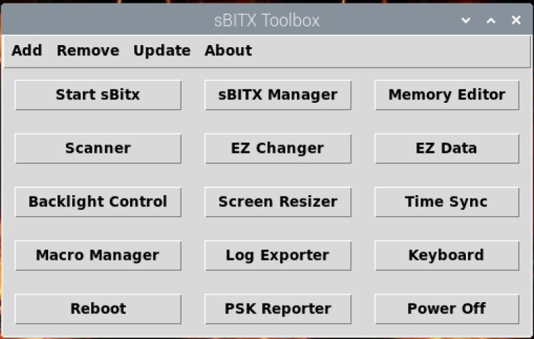

# sBITX-toolbox
sBITX Toolbox is a collection of utilities and accessory applications for the sBitx transceiver created by W9JES.

-----

What does sBITX Toolbox offer?

- sBITX Launcher: A convenient launcher style application that allows you to add, remove, or open apps with the click of a button.
- sBITX Manager: An application that can be used to store/recall frequency memories and provide auxiliary control of the transceiver.
- sBITX Scanner: An application that scans frequency ranges aiding in finding activity.
- sBITX Screen Resizer: A touchscreen application to change the default window size for better scrolling such as using WSJT-X and fldigi natively on the transceiver.
- sBITX Backlight Control: A touchscreen application to control the screen brightness for power conservation and eye comfort.
- sBITX EZ Tools: Applications to manage version upgrades/downgrades, configuration backups, and more.
- sBITX Time Sync: An application to easily check your system time and adjust it from the press of a button. Useful for digital modes.
- sBITX Macro Manager: An application to create, edit, and copy macros using predefined macros.
- sBITX Log Exporter: An application that allows logs to be selected and downloaded in ADIF.

-----

Windows Versions
-----

Click the links if you are looking for the Windows version of [sBITX Manager](https://github.com/drexjj/sBITX-toolbox/releases/tag/v2.0.3-sBITX-Manager) and [sBITX Scanner](https://github.com/drexjj/sBITX-toolbox/releases/tag/v1.0-sBITX-Scanner).

-----

Installation
-----

Install on you sBITX:

Plese see the instruction guide for installation steps. [Instruction Guide](https://github.com/drexjj/sBITX-toolbox/blob/main/sBITX%20Toolbox%20Guide%20%20v2.0.pdf)

-----

Instruction Guide
-----

The detailed instruction guide is now in PDF format and is located at [Instruction Guide](https://github.com/drexjj/sBITX-toolbox/blob/main/sBITX%20Toolbox%20Guide%20%20v2.0.pdf)

Release Notes are available at [Release Notes](https://github.com/drexjj/sBITX-toolbox/blob/main/release_notes.txt)

-----

